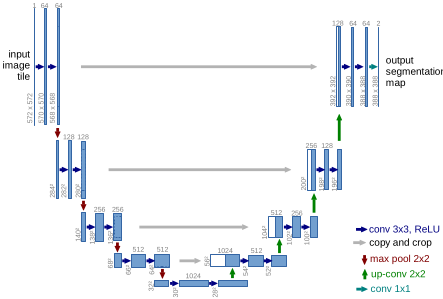

# U-Net

[//]: # (https://developers.arcgis.com/python/guide/how-cyclegan-works/#:~:text=The%20Cycle%20Generative%20Adversarial%20Network,output%20images%20using%20unpaired%20dataset.)

## Semantic segmentation

In `semantic segmentation` (`pixel-based classification`), we
classify each pixel to a particular class.

## U-Net

First used in biomedical image segmentation.

`U-Net` architecture has an encoder and a decoder.

### Encoder

First part of architecture.

Mostly a pretrained network (like VGG and Resnet).

It has `convolutional blocks` and `max-pools` for `downsampling`.

The result of `encoder` is features.

### Decoder

Second part of architecture.

Tries to semantically project the features that extracted
from `encoder` to the pixel space.

lower resolution (discriminative features)
-> higher resolution (pixel space)

`decoder` has `upsampling`, `concatenation` and `convolution`.

## references

[How U-net works?](https://developers.arcgis.com/python/guide/how-unet-works/#:~:text=The%20main%20contribution%20of%20U,learn%20representations%20with%20following%20convolutions)

